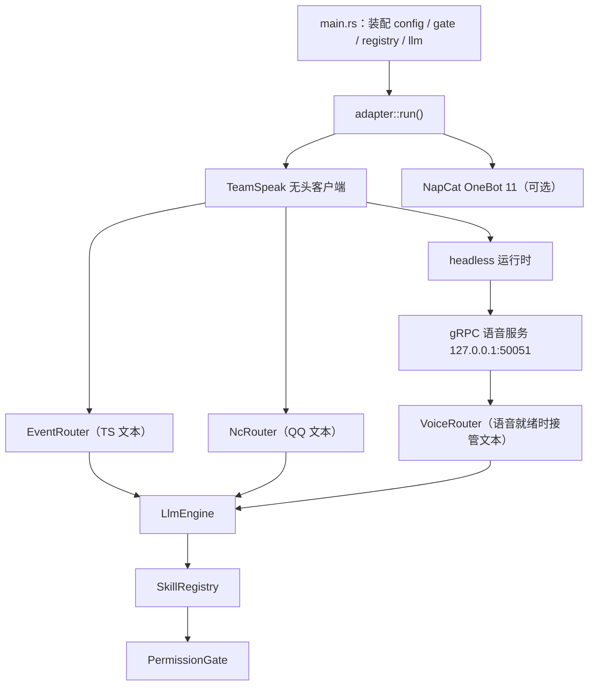

# 架构

TeamSpeakClaw 是 Rust 编写的单二进制 `teamspeakclaw` 聊天机器人，集成 TeamSpeak 无头客户端与 NapCat OneBot 11（QQ）两族入站适配器，通过 OpenAI 兼容接口驱动 LLM 技能。本文描述系统拓扑与关键代码路径；模块级明细以源码为准，逐模块的 `.instructions.md` 见源码内。

## 入口流

`main.rs` 只做装配：解析 CLI 参数，由 `AppConfig::load_all()` 加载 `config/settings.toml`、`acl.toml`、`prompts.toml`（目录取 `config_dir()` = `exe_dir().join("config")`），初始化 `PermissionGate`、`SkillRegistry`、`LlmEngine`，随后调用 `adapter::run()` 进入主循环，并监听 Ctrl-C / SIGTERM 触发优雅关闭。

`adapter::run()`（`adapter.rs`）是生命周期主循环：先 `TsAdapter::connect()` 建 TeamSpeak 连接，随后 `run_connected_session()` 按需启动 NapCat 适配器（`connect_if_enabled()`，未启用则为 `None`）与 headless 运行时，再经 `router::run_routers()` 并发运行 `EventRouter` 与 `NcRouter`。TeamSpeak 断线、NapCat supervisor 异常退出或 headless 组件失败都会结束本轮会话并进入重连循环（`adapter/reconnect.rs`，退避策略与尝试上限见该文件）。

## 双入站适配器

TeamSpeak 侧（`adapter/headless.rs`）封装 `tsclient-rs::Client`，提供建连、身份文件（`identity.json`）读写与等级升级、文本/断开事件回调、管理命令与 `send_text_message()` 等发送接口，接入参数与 STT/TTS 开关由 `config/headless.rs` 的 `HeadlessConfig` 控制。子模块 `adapter/headless/`：`actor` 是音频与通知发送的任务循环，`event` 是事件适配器与 `TsAdapter` 本身，`speech` 是 OPUS/STT/TTS 音频工具，`text_util` 是消息分片工具，`types` 是事件类型，`voice_service` 是 gRPC 服务端实现。

NapCat 侧（`adapter/napcat.rs`）是 OneBot 11 WebSocket 客户端，仅当 `config.napcat.enabled` 才连接。子模块 `adapter/napcat/`：`api` 封装 OneBot 动作调用，`ws` 是连接循环与请求-响应匹配，`event` 解析上行事件，`types` 定义消息段与 `NcApiResponse` 结构。

## 文本路由与语音桥

voice bridge 就绪时，TS 文本消息经 `VoiceRouter`（`router/voice_router.rs`）路由而非 `EventRouter`。由 `should_route_text_through_bridge(voice_configured, bridge_ready)` 决定：语音已配置（`voice_features_enabled()` = STT/TTS/omni 任一开启）且 `VoiceBridgeState` 就绪（gRPC 服务运行、事件流订阅就绪、actor 事件 handler 已注册）时，`ts_router::handle_message()` 直接跳过文本处理，语音桥接管。TS 触发策略（私聊直触 / 前缀剥离 / 回复目标）由 `router/trigger.rs:resolve_ts_inbound()` 统一计算；adapter 的 actor 只搬运原始文本。

`VoiceRouter` 以独立任务运行在 headless 运行时内，自带重连与退避循环，失败时置 `stream_ready=false` 触发文本回退。它提供音频 STT/TTS 双流水线：`audio_pipeline`（`OpusSttPipeline`）做音频分段，STT 经 `OpenAiSpeechProvider` 转写（omni 模式下改发 audio content），回复经流式句段切分器 + `stream_tts_audio` 返回语音；音乐 bot 的音频与聊天按其名字（`musicbot_name`）过滤，不进入 LLM。聊天与音频事件经 `actor.rs` 广播通道（控制/音频分离）送达，gRPC 定义见 `proto/voice.proto`，`build.rs` 用 `protoc-bin-vendored` + `tonic_build` 生成代码，内部监听地址为 `INTERNAL_GRPC_ADDR = "127.0.0.1:50051"`。

## 关键代码路径

`split_message()`（`adapter/headless/text_util.rs`）把消息按 UTF-8 字节长度切分为不超过 `MAX_MESSAGE_BYTES = 8192` 的分片，这是 TS3 ServerQuery 单行上限；每片在字符边界处截断，优先在空白符处切分（最多回看 256 字节），单字符超限时强制整体成片，分片边界空白符丢弃。

双发送路径均经 `split_message`：`event.rs:send_text_message()`（TS 文本路由与技能回复用）与 `actor.rs:notice_rx`（语音桥 `send_notice` 落地的文本通知用），后者对 1/2/3 目标模式归一后逐片 `sendTextMessage`。

## LLM 引擎

`llm.rs` 聚合 `llm/` 子模块：`engine` 是 `LlmEngine`（上下文装配与工具循环入口），`provider` 是 OpenAI 兼容 HTTP 客户端，`context` 是上下文窗口与轮次协调（`TurnCoordinator`：每会话串行锁 + 全局容量钳制），`tool_loop` 是流式工具循环。

引擎请求任意 `base_url/chat/completions`（流式）；解析流时忽略 `reasoning_content`（不存不转发）。上下文受 `max_context_turns` 与固定常量上限（`MAX_CONTEXT_SESSIONS = 1000`）控制；并发门禁只有 `TurnCoordinator`（容量 4 + 同会话串行锁），ts/nc/voice 三入口均 `try_reserve_turn_capacity` + `acquire_turn_session`；超时为常量：连接 10s、流空闲 30s、流总 300s。`omni_model`（`config/llm.rs`）开启时文本请求改走语音桥音频通道。

## 权限体系

`permission.rs` + `permission/gate.rs` 提供基于 `acl.toml`（`AclConfig`）的 `PermissionGate`：`get_allowed_skills()` 按服务组与频道组匹配规则求技能白名单（`*` 通配），`can_target()` 对受保护组（`protected_group_ids`）的交互须有 `can_target_admins` 授权。

## 技能系统

`skills.rs` 定义 `Skill` trait 与 `SkillRegistry` 注册表。跨平台统一用 `UnifiedExecutionContext`（构造器 `for_ts` / `for_nc`）；技能实现 `execute`，按 `ctx.platform` 分支或使用 `unified_ts_adapter` 取 TS 适配器。注册表按 ACL 白名单生成工具 schema 并执行技能调用。技能按目录分为 `communication`、`information`、`moderation`、`music`（后端见 `skills/music/`：`ts3audiobot`、`tsbot_http`、`tsmusicbot`）、`web_search`，默认注册表在 `DEFAULT_SKILLS`。

## 层级规范

- `main.rs` 只做初始化与装配，不含业务逻辑。
- 适配器层（`adapter/`）负责连接生命周期：建连、断连检测、重连。
- 路由层（`router/`）只做事件路由，不感知连接状态。

## 组件图

进一步阅读：开发流程见 [development.md](development.md)，测试约定见 [testing.md](testing.md)，编码反面准则见 [defensive-patterns.md](defensive-patterns.md)，CI/CD 见 [ci-cd.md](ci-cd.md)，决策记录见 [agent-notes.md](agent-notes.md)。
