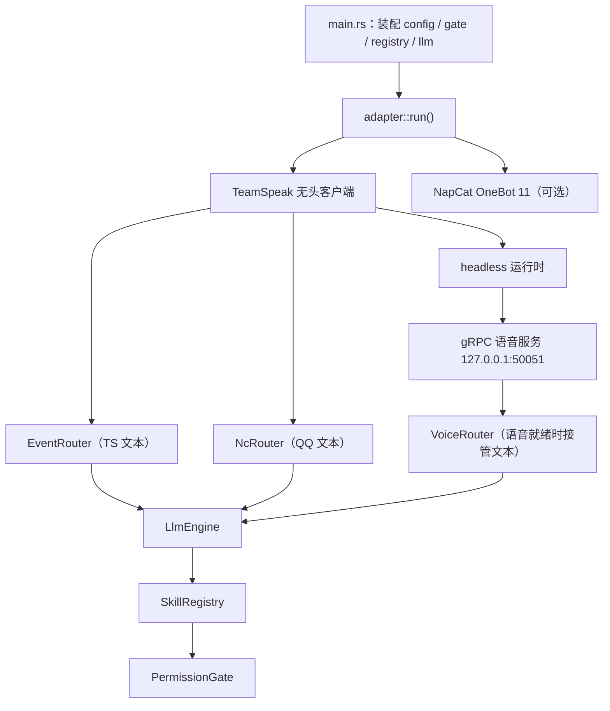

# 架构

TeamSpeakClaw 是 Rust 编写的单二进制 `teamspeakclaw` 聊天机器人，集成 TeamSpeak 无头客户端与 NapCat OneBot 11（QQ）两族入站适配器，通过 OpenAI 兼容接口驱动 LLM 技能。本文描述系统拓扑与关键代码路径；模块级明细以源码为准，目录级规则只出现在已建立的模块 `AGENTS.md`（当前为 `src/config/AGENTS.md` 与 `website/AGENTS.md`）中。

## 入口流

`main.rs` 只做装配：解析 CLI 参数，由 `AppConfig::load_all()` 加载 `config/settings.toml`、`acl.toml`、`prompts.toml`（目录取 `config_dir()` = `exe_dir().join("config")`），初始化 `PermissionGate`、`SkillRegistry`、`LlmEngine`，随后调用 `adapter::run()` 进入主循环，并监听 Ctrl-C / SIGTERM 触发优雅关闭。

`adapter::run()`（`adapter.rs`）是生命周期主循环：`[headless.wakeword]` 启用时先从 `models_dir()` 加载三个 OpenWakeWord 模型，缺文件或模型非法直接终止启动，不进入连接与重连；随后 `TsAdapter::connect()` 建 TeamSpeak 连接，再 `run_connected_session()` 按需启动 NapCat 适配器（`connect_if_enabled()`，未启用则为 `None`）与 headless 运行时，最后经 `router::run_routers()` 并发运行 `EventRouter` 与 `NcRouter`。TeamSpeak 断线、NapCat supervisor 异常退出或 headless 组件失败都会结束本轮会话并进入重连循环（`adapter/reconnect.rs`，退避策略与尝试上限见该文件）。

## 双入站适配器

TeamSpeak 侧（`adapter/headless.rs`）封装 `tsclient-rs::Client`，提供建连、身份文件（`identity.json`）读写与等级升级、文本/断开事件回调、管理命令与 `send_text_message()` 等发送接口，接入参数与 STT/TTS 开关由 `config/headless.rs` 的 `HeadlessConfig` 控制。子模块 `adapter/headless/`：`actor` 是音频发送（唯一 pacer）与客户端目录（唯一写者，经命令通道）的任务循环，`event` 是事件适配器与 `TsAdapter` 本身，`speech` 是 OPUS/STT/TTS 音频工具，`text_util` 是消息分片工具，`types` 是事件类型，`voice_service` 是 gRPC 服务端实现，`wakeword` 是 OpenWakeWord 唤醒门（推理核心 vendor 自 oww_rs；前端与分类器三个 onnx 均按配置从 `models_dir()` 运行时加载）。

NapCat 侧（`adapter/napcat.rs`）是 OneBot 11 WebSocket 客户端，仅当 `config.napcat.enabled` 才连接。子模块 `adapter/napcat/`：`api` 封装 OneBot 动作调用，`ws` 是连接循环与请求-响应匹配，`event` 解析上行事件，`types` 定义消息段与 `NcApiResponse` 结构。

## 文本路由与语音桥

voice bridge 就绪时，TS 文本消息经 `VoiceRouter`（`router/voice_router.rs`）路由而非 `EventRouter`。由 `should_route_text_through_bridge(voice_configured, bridge_ready)` 决定：语音已配置（`voice_features_enabled()` = STT/TTS/omni/voice_replay 任一开启）且 `VoiceBridgeState` 就绪（gRPC 服务运行、事件流订阅就绪、actor 事件 handler 已注册）时，`ts_router::handle_message()` 直接跳过文本处理，语音桥接管。TS 触发策略（私聊直触 / 前缀剥离 / 回复目标）由 `router/trigger.rs:resolve_ts_inbound()` 统一计算；adapter 的 actor 只搬运原始文本。

`VoiceRouter` 以独立任务运行在 headless 运行时内，自带重连与退避循环，失败时置 `stream_ready=false` 触发文本回退。它提供音频 STT/TTS 双流水线：`audio_pipeline`（`OpusSttPipeline`）做音频分段，STT 经 `OpenAiSpeechProvider` 转写（omni 模式下音频以 `input_audio` 直送 LLM），模型回复始终是文本、在 `[headless.tts]` 开启时经流式句段切分器切段，再由 `OpenAiSpeechProvider` 逐段合成、编码后推进出站 FIFO 播放；STT 与 omni 两条语音回合都另挂工具调用提示音（`web_search` 取「我来看看」/「我来搜索下」，其余工具取「我来研究下」），一轮对话只在第一次工具调用开始执行时入队；唤醒确认音取「嗯哼」/「在呢」。短语池由 `router/voice_feedback.rs` 在 TTS 有效开启时于启动期尽力预热并缓存为 48k 立体声 PCM，失败只记日志、首次触发按需实时合成，命中缓存才不再发起 TTS 请求；同一触发点内轮换取用，触发时以 `AudioOutput` 的 PCM 片段入队。出站音频统一经 `AudioOutput` FIFO（唯一持有 `ts3_audio_tx` 写端）；TTS 会话按 LLM 流创建与关闭：首个可播句段到达时开一条流并起它的 synth 任务，`finish_reason` 到达时只关掉该流的句段通道（`close_stream`），synth 任务随后 `finish_drained` 等本流音频播完才结束该 job；工具轮与最终回复因此各占一条会话，工具提示音与最终回复按 FIFO 入队顺序排在工具轮流之后；每条流的 synth 任务独占持有该流的会话，播完本流音频再放掉回合句柄，轮次收尾只关当前流、不等播放；音乐 bot 的音频与聊天按其名字（`musicbot_name`）过滤，不进入 LLM。`[headless.wakeword]` 启用时，音频收帧路径逐帧喂唤醒门（`feed_wakeword_frame`，per-clid 实例池 + `window_secs` 开门窗口；门内部按 80ms 块推理，跨帧余量由 `acc` 携带，帧起点、帧长与 VAD 活跃累计都落进该 clid 的会话），命中即取消当前占用出站音频的回合（LLM 取消令牌 + TTS 播放取消，不分回合归属），插话不必等 utterance 收尾；收尾时门的 `take_utterance_verdict` 一并给出命中、窗口与独占三项，裁决随 utterance 交给 `admit_audio_chunk`，在 caller 解析与 gRPC 查询之前按 `decide_wakeword_action` 调度：关门、或机器人已开始产出而本条未命中唤醒词时丢弃；命中块锚点（`WakeEvent::fire_sample`，命中块在该 clid 时间轴上的绝对起始采样位置）之后活跃语音不足 `WAKE_ONLY_TAIL_MS = 200ms` 的 utterance 判为只有唤醒词，播预生成的确认音并就地登记一个播报回合，不进 STT/LLM；锚点、锚点后活跃毫秒与命中块序号随裁决进 `voice.wakeword.calibration` 与 `voice.wakeword.confirm` 日志。准入只做裁决，回合在独立任务里跑，omni 与 STT 两路走同一道门。聊天与音频事件经 `actor.rs` 广播通道（控制/音频分离）送达，gRPC 定义见 `proto/voice.proto`，`build.rs` 用 `protoc-bin-vendored` + `tonic_build` 生成代码，内部监听地址为 `INTERNAL_GRPC_ADDR = "127.0.0.1:50051"`。

## 关键代码路径

`split_message()`（`adapter/headless/text_util.rs`）把消息按 UTF-8 字节长度切分为不超过 `MAX_MESSAGE_BYTES = 8192` 的分片，这是 TS3 ServerQuery 单行上限；每片在字符边界处截断，优先在空白符处切分（最多回看 256 字节），单字符超限时强制整体成片，分片边界空白符丢弃。

文本发送只有一个实现：`text_util::send_text_message()` 用 `split_message` 把整条消息切分后逐片 `sendTextMessage`。两个调用方是 `event.rs:TsAdapter::send_text_message()`（TS 文本路由与技能回复用）与 `voice_service.rs:VoiceServiceImpl::send_notice()`（语音桥 `send_notice` 的落地端，先把目标模式归一为 1/2/3 再复用该实现）。

## LLM 引擎

`llm.rs` 聚合 `llm/` 子模块：`engine` 是 `LlmEngine`（上下文装配与工具循环入口），`provider` 是 OpenAI 兼容 HTTP 客户端，`context` 是上下文窗口与轮次协调（`TurnCoordinator`：每会话串行锁与到达顺序链 + 全局容量钳制），`tool_loop` 是流式工具循环。TS 文本、NapCat 与语音三条入站路径的回合骨架统一在 `router/turn.rs`：`TurnRequest` 提供提示与输入（`TurnInput::{Text, Audio}` 决定消息装配与历史落库的分支）、`TurnSink` 实现各自的回复落点，门禁、工具循环、体积类失败收缩重试与「送达成功才落上下文」由该模块承担。

引擎请求任意 `base_url/chat/completions`（流式）；解析流时忽略 `reasoning_content`（不存不转发）。上下文受 `max_context_turns` 与固定常量上限（`MAX_CONTEXT_SESSIONS = 1000`）控制；并发门禁只有 `TurnCoordinator`（容量 4 + 同会话串行锁 + 同会话到达顺序链），由 `router/turn.rs` 的 `TurnPermit::reserve` 与 `LlmEngine::enqueue_turn_ticket`（事件循环里同步占容量、同步发票据）同 `TurnPermit::acquire_session`（任务内先等前一条同会话回合结束再取串行锁，生成 `TurnSession` 并持有到回复落库完成）施加，取锁顺序即事件循环里的到达顺序，不受任务调度影响；TS 文本与 NapCat 在占位与排队之前先过准入同步门（bot 自身与音乐 bot 的消息、桥接文本、未触发文本、空文本、超限文本直接丢弃），语音桥回合在取得会话锁且 TTS 初始化成功后才标记正在产出；超时为常量：连接 10s、流空闲 30s、流总 300s。`omni_model`（`config/llm.rs`）开启时语音输入以 `input_audio` content 送入模型替代 STT，模型输出仍是文本流；该标志同时计入 `voice_features_enabled()`，bridge 就绪时 TS 文本消息随之经 `VoiceRouter` 路由。上下文的历史轮同样可携带音频：音频轮以 WAV 字节存入会话并缓存其 base64 编码，构建请求时按 `input_audio` content 回放；存储层以「一轮对话」（user+assistant 成对）为单位从最早逐轮丢弃，受 `max_context_turns`、单会话 `MAX_AUDIO_HISTORY_BYTES = 8 MiB` 与全局 `MAX_AUDIO_HISTORY_BYTES_TOTAL = 256 MiB` 约束，字节预算至少保留最新一轮、不会清空会话历史；装配层另按 `MAX_WIRE_AUDIO_BYTES = 2 MiB` 裁剪最早的音频轮以约束请求体（`max_context_turns` 管轮数、wire 预算管体积，文本轮不参与裁剪）。发送前按 `MAX_REQUEST_BODY_BYTES = 64 MiB` 预检序列化后的请求体，预检失败与网关 413、带体积文案的 400 归为同一类错误，命中时丢弃该会话最早的音频轮并重试一次；NapCat 会话不存音频，无轮可丢时按原错误失败。

## 权限体系

`permission.rs` + `permission/gate.rs` 提供基于 `acl.toml`（`AclConfig`）的 `PermissionGate`：`get_allowed_skills()` 按服务组与频道组匹配规则求技能白名单（`*` 通配），`can_target()` 对受保护组（`protected_group_ids`）的交互须有 `can_target_admins` 授权。

## 技能系统

`skills.rs` 定义 `Skill` trait 与 `SkillRegistry` 注册表。跨平台统一用 `UnifiedExecutionContext`（构造器 `for_ts` / `for_nc`）；技能实现 `execute`，按 `ctx.platform` 分支或使用 `unified_ts_adapter` 取 TS 适配器。注册表按 ACL 白名单生成工具 schema 并执行技能调用。技能按目录分为 `communication`、`information`、`moderation`、`music`（后端见 `skills/music/`：`ts3audiobot`、`tsbot_http`、`tsmusicbot`）、`web_search`，默认注册表在 `DEFAULT_SKILLS`。

## 层级规范

- `main.rs` 只做初始化与装配，不含业务逻辑。
- 适配器层（`adapter/`）负责连接生命周期：建连、断连检测、重连。
- 路由层（`router/`）只做事件路由，不感知连接状态。

## 组件图

```mermaid
flowchart TD
    main["main.rs：装配 config / gate / registry / llm"] --> adapt["adapter::run()"]
    adapt --> ts["TeamSpeak 无头客户端"]
    adapt --> nc["NapCat OneBot 11（可选）"]
    ts --> er["EventRouter（TS 文本）"]
    ts --> ncr["NcRouter（QQ 文本）"]
    ts --> hl["headless 运行时"]
    hl --> vs["gRPC 语音服务 127.0.0.1:50051"]
    vs --> vr["VoiceRouter（语音就绪时接管文本）"]
    er --> llm["LlmEngine"]
    ncr --> llm
    vr --> llm
    llm --> skills["SkillRegistry"] --> gate["PermissionGate"]
```

进一步阅读：开发流程见 [development.md](development.md)，测试约定见 [testing.md](testing.md)，编码反面准则见 [defensive-patterns.md](defensive-patterns.md)，CI/CD 见 [ci-cd.md](ci-cd.md)，决策记录见 [agent-notes.md](agent-notes.md)。
